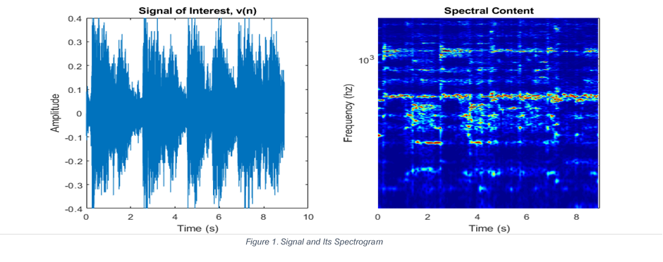
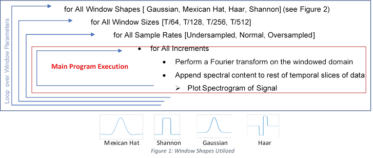
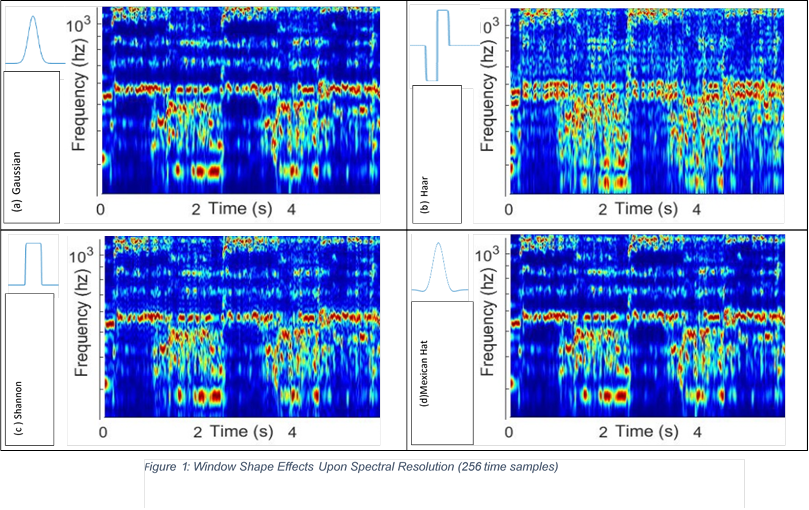
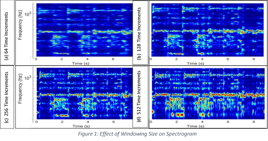
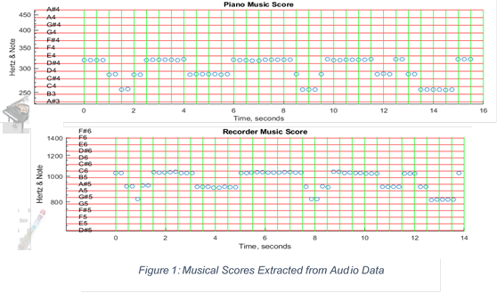
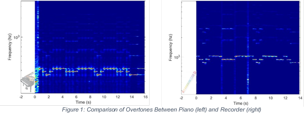

<html>

<head>
<meta http-equiv=Content-Type content="text/html; charset=windows-1252">
<meta name=Generator content="Microsoft Word 15 (filtered)">

</head>

<body lang=EN-US link=blue vlink="#954F72">

<h1 align=center style='text-align:center'>Nicolette Lewis</h1>

<h1 align=center style='text-align:center'>AMATH 582:&nbsp;Computational Methods for Data Analysis</h1>

<h1 align=center style='text-align:center'> Homework 2 </h1>

<h1 align=center style='text-align:center'> February 7, 2020 </h1>

<h1>Abstract</h1>

<h6 style='text-indent:.5in;line-height:normal'>Windowed Fast Fourier transforms were performed on a 9
second segment of Handel’s Messiah, with various window widths, window shapes,
and sample rates. Spectrograms for each windowing condition were generated, and
the characteristics of the windowing effects on the score were investigated. After
this analysis was completed, the knowledge obtained of the windowing effects on
the sound files was utilized to generate scores of Mary Had a Little Lamb,
played on both recorder and the piano. The timbre of the instruments was
inspected via spectrograms of the recordings, and the score of the song’s
primary notes was reproduced as a plot of frequency versus time. Results of
this analysis are available in Section IV, Computational Results. </h6>

<h1 style='margin-top:0in;line-height:normal'>Sec. I. Introduction and Overview </h1>

<h6 style='line-height:normal'>            Frequency analysis can provide decomposition of a signal
into its constituent frequency components. However, for a signal over time or
space, Fourier transformations alone are insufficient to resolve the
temporal/spatial fluctuations in frequency. Through the use of Fourier
transforms on time-windowed sections, it is possible to quantify frequency
content of a signal over time. This is known as a Gabor transform, a modification
upon the original Fourier Transform kernel, which allows us to achieve localization
of signal maxima in both the frequency and time domains. Utilizing this
principle, it is possible to temporally proceed through a signal and determine
the predominant frequencies at each instant in time. A visual representation of
the results of this analysis is typically known as a spectrogram; Spectrograms colormap
frequency magnitudes over a duration of time, utilizing a frequency scale along
a second axis to represent the location of the signal amplitude maxima within
the spectrum. A signal along with its decomposed frequencies over time can be
seen in figure 1, with the signal on the left and its spectrogram on the right.
</h6>

<table cellpadding=0 cellspacing=0>
 <tr>
  <td width=22 height=0></td>
 </tr>
 <tr>
  <td></td>
  <td></td>
 </tr>
</table>

 
Higher magnitudes within a frequency band
are represented by hotter colors, while absense of magnitude is represented by
cooler colors. With the proper amount of sampling, that is, careful incrementation
and bandwidth of the Gabor time window, it is possible to resolve a signal’s
primary frequencies over time without artifacts of the previous windowed domain
showing up. Various forms of Gabor window were implemented upon Handel’s Messiah,
in order to determine the effects of the shape of the window on the frequency
resolution of the signal. Along with window shape, window sizes and sampling
rates were modified, and the effects of oversampling and undersampling a signal
were inspected. Windows upon time and frequency were determined as follows to
resolve signal magnitude at &#957;, &#964;.

·&nbsp;&nbsp;&nbsp;&nbsp;&nbsp;&nbsp;&nbsp;&nbsp;
&#957;
= m*&#969;0 &lt;- where m is the number of frequency bands and &#969;0 is the
frequency band increment

·&nbsp;&nbsp;&nbsp;&nbsp;&nbsp;&nbsp;&nbsp;&nbsp;
&#964;
= n*t0 &lt;- where n is the number of time windows and t0 is the incrementation
in time windowing. 

Effects of undersampling
include lack of resolution within the temporal domain, but high resolution of frequency
content within the sampled domain, however incomplete this representation of
the frequency content of the full signal may be. On a spectrogram , this is
noted by thin streaks of resolved frequency bands across lengthy time scales. An
appropriately sampled signal will resolve both spectral and temporal content of
the signal to an acceptable degree, with a bit of uncertainty with respect to
frequency and time localization of key features. With this degree of sampling,
the peaks within the spectrogram  will be localized in both temporal and
spectral domains. Further sampling of the signal beyond what would resolve frequency
content adequately constitutes oversampling, which provides strong resolution
of features within the signal’s temporal domain, but blurs the spectral
fidelity of the sampled content. This results in smearing of the spectral
domain, with high fidelity within the temporal domain. Effects of various
amounts of sampling can be seen in Section IV. 

<h1 style='line-height:normal'>Sec. II. Theoretical Background </h1>

We
can easily obtain a Fourier transform of a set of points and resolve the
frequency content of such a set; However, signals over time or space contain
sets of points for each instance of the domain, and as a result, will lose the
spatial or temporal resolution of frequency magnitude peaks within the signal once
a Fourier transform is performed. This is due to the integration over the spatial
or temporal domain which must be completed in order to resolve the magnitude of
the frequencies of the signal throughout the domain. If the entire signal is
sampled when a Fourier transform is completed, the frequency content of the
signal’s entire domain is represented in the Fourier transform. 

One
way to temporally localize peaks in the frequency of a signal is to utilize a
window upon the temporal domain and perform a Fourier transform solely within
the windowed domain. This way, the frequency content obtained from a spectral
analysis of the window is known to most likely be within the window from which
the frequency content was calculated. Sliding the window over the domain and
performing Fourier transforms on the window creates spectral representations of
each instance of windowing. These spectral analysis ‘slices’ can be plotted
over time creating spectrograms to demonstrate the changes in frequency content
throughout the signal.

The
chosen method employed here and described above is known as a Gabor Transform,
a windowed version of the Fourier transform which involves replacing the
original kernel of the Fourier transform with one that allows a window to slide
over the domain of the function and isolate local frequency content centered
around the window in time. What is described is a discrete form of the
integral, 

where the function f(t) represents the signal
as it varies with time and g(t, ) represents the Gabor Window which is
utilized to filter the signal temporally. This can be represented in the
following form, as found in Kutz’ <i>Data Driven Modelling and Scientific
Computation.</i>

By definition, a signal is
oversampled if  0 &lt; t0, &#969;0 &lt; 1, and
undersampled if &#969;0, t0 &gt; 1. A reasonable sampling window is one where
each window overlaps the window previous, but not enough to saturate the
current window with artifacts from the previous (i.e. w0, t0 =1).

<h1>Sec. III.
Algorithm Implementation and Development </h1>

            Implementation
of this analysis was started by importing the music file as a vector into
Matlab. The signals were then windowed over time with the following waveforms, in
order to produce time samples of the signal which would then be Fourier transformed
into the spectral domain. After the sample was windowed in time, the windowed
portion of the sample was transformed into the spectral domain. This
transformed ‘slice’ of the signal at a particular window of time was appended
to an array which held the Fourier transformations of the slices previous. By
plotting the frequency content of the signal versus the time domain in a
colormap which relates magnitude of frequency to colormap magnitude, we can
observe the fluctuations in frequency content over time in the form of a
Spectrogram. Various window shapes were utilized in this analysis such as to
observe the effect of the window shape on the Fourier transform of the increments
of the signal. In addition to this, the size of the Gabor windowed section was
varied, as well as the overlap of the Gabor window from increment to increment.
This was completed to obtain spectral representations of the signal when it is undersampled,
appropriately sampled, and oversampled, and to compare the resolutions of the spectral
content in both frequency and temporal domains.  Programmatically, this can be represented with
the following nested loop. 

 

            

&nbsp;

&nbsp;

&nbsp;

&nbsp;

&nbsp;

&nbsp;

&nbsp;

&nbsp;

<table cellpadding=0 cellspacing=0 align=left>
  <td></td>

Figure
3: Spectrograms Representing
Transition from Undersampled (left) to Oversampled (right),

Vertical
Axis is Frequency in Hz, Horizontal Axes is Time in Seconds.

 </table>

&nbsp;

 

<h1 style='margin-top:0in'> 
Sec. IV.
Computational Results </h1>

            With
the above calculations performed on the 9 second excerpt of Handel’s Messiah,
various spectrograms were generated of the frequency content of the excerpt. Figure
3 shows the progression of the spectral analysis from an undersampled to an oversampled
signal. Moving left to right across the figure depicts the transition from high
fidelity of the resolved frequency content to high fidelity of the temporal
location of signal magnitudes, with losses in spectral fidelity. 

This effect is due
to the nature of the analysis being subject to Heisenberg’s Uncertainty principle
(where resolution is high in one inspected parameter, it is not without
compromising resolution of another parameter). In addition to the effects of
sample rates upon the frequency and temporal resolution of the signal, effects
of window width and shape upon the fidelity of the spectrograms of Handel’s
Messiah were investigated. Figure 4 depicts increasing resolution of the
temporal perturbations in the signal with smaller windows in time, while frequency
resolution decays as the windows in time shrink. This can be explained in the
following way; In order for particular frequencies to be actualized within a
spectral analysis, the wavelengths of the frequencies of interest must be able
to fit within the windowed section of the signal. If such a wavelength does not
fit within the window, the resolution of the frequency associated with it will
be blurred across the spectral domain, since the wave will be attenuated. This
attenuation of the signal frequencies from small time windows results in
uncertainty of spectral resolution with high temporal certainty, and the
reverse is also true with larger windows in time.

As
the number of windowed segments of the signal increases, the resolution in temporal
domain increases of the higher frequencies within the spectrogram. This is at
expense of the resolution of the lower frequency Fourier modes, which become
blocky and blurred as the size of the window decreases beyond their
wavelengths. Initially, with very large windows over time (Fig. 4a), the lower
frequency content of the signal is resolved quite well, but the durations of
the frequency peaks are blurred across time. The rest of Fig. 4 show the
resolution of mid-low range frequency content with 128 time segments (Fig. 4b),
mid-high range frequency content with 256 time segments (Fig. 4c), and high
range frequency content with 512 time segments (Fig. 4d). (Note: For the rest
of these comparisons the number of time increments used was 256. As can be seen
from Figure 5, the shape of the time windowing function has an influence on the
frequency resolution within the spectrogram. The Haar wave shape (Figure 5b)
acts as a sink function around the time window of interest, resulting in frequency
ranges resolved around primary frequencies; pretty neat! It provides great
temporal resolution of the signal, with great uncertainty in the frequency
domain. Mexican Hat  (Figure 5d) and Gaussian  (Figure 5a) windows have a
similar effect upon the resolution of frequency, however, Mexican Hat windows
appear to be less prone to the effects of oversampling than the Gaussian window,
and more prone to the effects of undersampling. Shannon windows  (Figure 5c)  provide
less uncertainty than Haar windows in the frequency domain, but their sharp
corners still lend to noise effects from the rapid attenuation of wavelengths
not fully resolved within the window. Shannon windows, like Haar windows,
provide great temporal resolution of the signal, with less fidelity in the
spectral domain than Gaussian or Mexican Hat windows. Using this knowledge, spectrograms
of the song “Mary Had a Little Lamb” were generated and the notes played over
time were determined and the maximum frequency of each time increment was plotted
as a music score in Figure 6. The song was played both with a piano and a recorder,
and the differing overtones of the musical instruments were inspected. Time
windows were incremented by half second and the Mexican Hat window was used for
the analysis. 

            The richness of the sound of a piano compared
to the flat droning of a recorder is evident not only by listening to the notes
played by the instruments, but by performing a Short Time Fourier Transform on a
recording and observing the overtones that occur at integer multiples of the fundamental
frequency of the note. The nature of the overtones characterize the timbre of
the instrument, and as can be seen on the left of Fig. 7, the piano produces
many more overtones than the recorder, at a much higher amplitude, contributing
to the pleasant self-harmonization we have come to associate with piano
sounds. 

<h1>Sec. V. Summary and Conclusions </h1>

            As noted in the Introduction, frequency
analysis alone can be insufficient to resolve temporal perturbations in a
signal, as localized time information is lost through integration of the frequency
over the temporal domain. Similarly, time history analysis alone is
insufficient to resolve spectral information about the data that could be
extremely useful to decomposing the signal into something needed. A Gabor Transform,
or Short Time Fourier Transform, compromises resolution in both time and
frequency domains to extract localized maxima in both frequency and time, coupling
time windowing and Fourier transforms on windowed parts of a signal to resolve
temporal fluctuations in spectral maxima as the window slides over time. This
sort of analysis can be used to decompose songs into scores, store melodies as
a vector, and other really cool things with signals, like finding localized frequency
content in a space. The full output data and dozens more spectrograms from the Matlab
programs held in Appendix B can be found on GitHub, at 

&nbsp;

<h1>Appendix A - MATLAB functions used and brief implementation
explanation </h1>

fftshift - Shift zero-frequency component
to center of spectrum

NikkiLewis_AMATH582_Homework1.m[lines
42, 106]

Utilized to shift the
frequency data domain to one that is monotonically increasing. 

Description

 <code>Y
= fftshift(</code><a
href="https://www.mathworks.com/help/matlab/ref/fftshift.html#bviss0f-1-X"><code>X</code></a><code>)</code>&nbsp;rearranges
a Fourier transform&nbsp;<code>X</code>&nbsp;by
shifting the zero-frequency component to the center of the array. If&nbsp;<code>X</code>&nbsp;is a
multidimensional array, then&nbsp;<code>fftshift</code>&nbsp;swaps
half-spaces of&nbsp;<code>X</code>&nbsp;along
each dimension.

Source Mathworks- Matlab R2019a Documentation – fftshift() – FFT Shift <a href="https://www.mathworks.com/help/matlab/ref/fftshift.html">https://www.mathworks.com/help/matlab/ref/fftshift.html</a>

&nbsp;

fft
- fast Fourier transform

Utilized to convert the temporal
domain data to frequency domain data.

Description 

Y =
fftn(<a
href="https://www.mathworks.com/help/matlab/ref/fftn.html#bvhcsbe-1-X">X</a>)&nbsp;returns the&nbsp;<a
href="https://www.mathworks.com/help/matlab/ref/fftn.html#bvhcsbe-8">multidimensional Fourier transform</a>&nbsp;of an N-D array using a fast Fourier transform algorithm.
The N-D transform is equivalent to computing the 1-D transform along each
dimension of&nbsp;X. 

Source Mathworks- Matlab R2019a Documentation – fftn () – n-d Fast
Fourier Transform <a href="https://www.mathworks.com/help/matlab/ref/fftn.html">https://www.mathworks.com/help/matlab/ref/fftn.html</a>

</body>

</html>

Appendix B MATLAB codes
------------------------------------------------------------------------------------------------------------------------------------------------------------
function window.m
------------------------------------------------------------------------------------------------------------------------------------------------------------
				sig=nbins/(8*increment);

				if w==1;
				g=exp(-sig^2*(t-gtslice(i)).^2); % gaussian
				wavename='Gaussian Window';
				end
				% plot(t,g)
				% figure
				if w==2;
				% % % mexican hat wavelet
				wavename='Mexican Hat Window';
				g=(1-(t-gtslice(i)).^2).*exp((sig^2)*-(t-gtslice(i)).^1.982); 
				end
				% plot(t,g)
				% figure
				if w==3;
				% % Square gabor window
				wavename='Shannon Window';
				g=exp(-((t-gtslice(i)).*sig).^40).*sig; % shannon
				g=g./max(g);
				end
				% plot(t,g)
				% figure
				if w==4;
				% % haar wavelet
				wavename='Haar Window';
				g=exp(-((t-gtslice(i)).*sig).^40).*sig; % gaussian
				g=-g./max(g);
				g((i*increment) - increment+1:end)=-g((i*increment) - increment+1:end);
				end
------------------------------------------------------------------------------------------------------------------------------------------------------------
function main.m
------------------------------------------------------------------------------------------------------------------------------------------------------------
				load handel
				scalestart=5;
				scalesend=8;
				instrument='handel';

				v = y'/2;

				nsamples=length(v);
				nbins=nsamples/2;
				t=(1:length(v))/Fs; % this is our T
				dt=t(2)-t(1);
				termtime=nsamples*dt;

				% number of increments
				gt2=linspace(0,max(t),nsamples+1); gt=gt2(1:nsamples); 
				df = Fs/nbins;
				k = (0:df:(Fs-df)) - (Fs-mod(nsamples,2)*df)/2; %<- stack exchange

				ks=fftshift(k);

				for w=1:4;

				sizes=[nsamples/64 , nsamples/128, nsamples/256, nsamples/512];

						for size=1:length(sizes)
								sffttot=[];

								increment=sizes(size)

								for SR=1:3;
										if SR==1;
								gtslice=gt(1:increment:end); % sampled
								samplerate='reg';
										end
										if SR==2;
								gtslice=gt(1:increment*3:end); % undersampled
								samplerate='und'
										end
										if SR==3;
								gtslice=gt(1:increment/3:end); % oversampled
								samplerate='ovs'
										end 

								sffttot=[];

								for i=1:length(gtslice); 
								window
								sfft=fft(g.*v); 
								sffttot=[sffttot;abs(fftshift(sfft(end/2 +1: end))/max(abs(sfft)))]; 
								end

								f=figure("Visible",false); 
								pcolor(gtslice,k,sffttot'); hold on
								axis([-2 max(t) min(hzvec) max(hzvec)])
								colormap jet
								shading interp
								set(gca, 'YScale', 'log')
								xlabel('Time (s)')
								ylabel('Frequency (hz)')
								title(wavename)
								print(wavename+string(termtime*2*pi/increment)+instrument+samplerate+'.jpg','-djpeg')
								close(f) 
								end
						end
				end
				end
				end
------------------------------------------------------------------------------------------------------------------------------------------------------------
function SheetMusic.m
------------------------------------------------------------------------------------------------------------------------------------------------------------
				% 
				% tr_piano=16; % record time in seconds
				% y=audioread('music1.wav'); Fs=length(y)/tr_piano;
				% scalestart=3;
				% scalesend=5;
				% instrument='Piano'
				% 
				tr_rec=14; % record time in seconds
				y=audioread('music2.wav'); Fs=length(y)/tr_rec;
				scalestart=5;
				scalesend=7;
				instrument='Recorder'

				v = y'/2;

				nsamples=length(v);
				nbins=nsamples/2;
				t=(1:length(v))/Fs; % this is our T
				dt=t(2)-t(1);
				termtime=nsamples*dt;

				% number of increments
				gt2=linspace(0,max(t),nsamples+1); gt=gt2(1:nsamples); 
				df = Fs/nbins;
				k = (0:df:(Fs-df)) - (Fs-mod(nsamples,2)*df)/2; 

				ks=fftshift(k); 
				for w=2;

				sizes=[nsamples/64];

				for size=1:length(sizes)
						sffttot=[];

				increment=sizes(size)

				gtslice=gt(1:increment:end); % sampled
				% gtslice=gt(1:increment*2:end); % undersampled
				% gtslice=gt(1:increment/2:end); % oversampled

				for i=1:length(gtslice); 
				window 
				sfft=fft(g.*v); 
				sfft=fftshift(sfft); 
				sffttot=[sffttot;abs(fftshift(sfft(end/2 +1: end))/max(abs(sfft)))]; 
				[maxval,ind]=max(sfft((end-1)/2 : end)); 
				currentnote(i)=ks(ind)/2; 
				end 
				end
				end

				figure(2) 
				ScalesPlot

				plot(circshift(gtslice,1),abs(currentnote),'o')
				Time
				xlabel('Time, seconds')
				ylabel('Hertz & Note')
				set(gca, 'YScale', 'log')
				title([instrument,' Music Score'])
				axis([-2 max(t) min(hzvec)*1.25 max(hzvec)/1.25])   
				end
------------------------------------------------------------------------------------------------------------------------------------------------------------
function ScalesPlot.m
------------------------------------------------------------------------------------------------------------------------------------------------------------
				%%

				ScaleString={{'C0'};
				{'C#0'};
				{'D0'};
				{'D#0'};
				{'E0'};
				{'F0'};
				{'F#0'};
				{'G0'};
				{'G#0'};
				{'A0'};
				{'A#0'};
				{'B0'};
				{'C1'};
				{'C#1'};
				{'D1'};
				{'D#1'};
				{'E1'};
				{'F1'};
				{'F#1'};
				{'G1'};
				{'G#1'};
				{'A1'};
				{'A#1'};
				{'B1'};
				{'C2'};
				{'C#2'};
				{'D2'};
				{'D#2'};
				{'E2'};
				{'F2'};
				{'F#2'};
				{'G2'};
				{'G#2'};
				{'A2'};
				{'A#2'};
				{'B2'};
				{'C3'};
				{'C#3'};
				{'D3'};
				{'D#3'};
				{'E3'};
				{'F3'};
				{'F#3'};
				{'G3'};
				{'G#3'};
				{'A3'};
				{'A#3'};
				{'B3'};
				{'C4'};
				{'C#4'};
				{'D4'};
				{'D#4'};
				{'E4'};
				{'F4'};
				{'F#4'};
				{'G4'};
				{'G#4'};
				{'A4'};
				{'A#4'};
				{'B4'};
				{'C5'};
				{'C#5'};
				{'D5'};
				{'D#5'};
				{'E5'};
				{'F5'};
				{'F#5'};
				{'G5'};
				{'G#5'};
				{'A5'};
				{'A#5'};
				{'B5'};
				{'C6'};
				{'C#6'};
				{'D6'};
				{'D#6'};
				{'E6'};
				{'F6'};
				{'F#6'};
				{'G6'};
				{'G#6'};
				{'A6'};
				{'A#6'};
				{'B6'};
				{'C7'};
				{'C#7'};
				{'D7'};
				{'D#7'};
				{'E7'};
				{'F7'};
				{'F#7'};
				{'G7'};
				{'G#7'};
				{'A7'};
				{'A#7'};
				{'B7'};
				{'C8'};
				{'C#8'};
				{'D8'};
				{'D#8'};
				{'E8'};
				{'F8'};
				{'F#8'};
				{'G8'};
				{'G#8'};
				{'A8'};
				{'A#8'};
				{'B8'};}; 
				hertz=flip([7458.6;
				7040;
				6644.875;
				6271.927;
				5919.911;
				5587.652;
				5274.041;
				4978.032;
				4698.636;
				4434.922;
				4186.009;
				3951.066;
				3729.31;
				3520;
				3322.438;
				3135.963;
				2959.955;
				2793.826;
				2637.02;
				2489.016;
				2349.318;
				2217.461;
				2093.005;
				1975.533;
				1864.655;
				1760;
				1661.219;
				1567.982;
				1479.978;
				1396.913;
				1318.51;
				1244.508;
				1174.659;
				1108.731;
				1046.502;
				987.7666;
				932.3275;
				880;
				830.6094;
				783.9909;
				739.9888;
				698.4565;
				659.2551;
				622.254;
				587.3295;
				554.3653;
				523.2511;
				493.8833;
				466.1638;
				440;
				415.3047;
				391.9954;
				369.9944;
				349.2282;
				329.6276;
				311.127;
				293.6648;
				277.1826;
				261.6256;
				246.9417;
				233.0819;
				220;
				207.6523;
				195.9977;
				184.9972;
				174.6141;
				164.8138;
				155.5635;
				146.8324;
				138.5913;
				130.8128;
				123.4708;
				116.5409;
				110;
				103.8262;
				97.99886;
				92.49861;
				87.30706;
				82.40689;
				77.78175;
				73.41619;
				69.29566;
				65.40639;
				61.73541;
				58.27047;
				55;
				51.91309;
				48.99943;
				46.2493;
				43.65353;
				41.20344;
				38.89087;
				36.7081;
				34.64783;
				32.7032;
				30.86771;
				29.13524;
				27.5;
				25.95654;
				24.49971;
				23.12465;
				21.82676;
				20.60172;
				19.44544;
				18.35405;
				17.32391;
				16.3516;
				]);

				hzvec=hertz(length(hertz)/9 *scalestart +1 :length(hertz)/9 * scalesend )
				currscale=ScaleString(length(hertz)/9 *scalestart +1 :length(hertz)/9 * scalesend,1);
				hold on 
				for i=1:length(hzvec); 
				semilogy([-2,max(t)],[hzvec(i),hzvec(i)],'r'); 
				text(-1.5,hzvec(i)*1.01,string(currscale(i)))
				end

</body>

</html>
